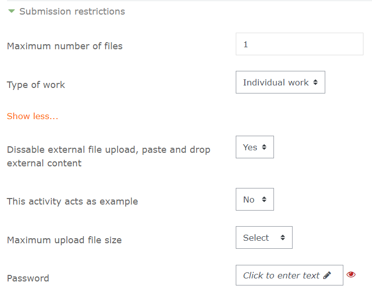

# Tự động hóa đánh giá bài tập lập trình trên Moodle với VPL module (Virtual Programming Lab) 

### [Nguyễn Đình Hưng](https://nd-hung.github.io)
#### Khoa CNTT Trường đại học Nha Trang

<br>

## [1 - Sơ lược về VPL](#intro)
## [2 - Cài đặt VPL](#install)
## [3 - Sử dụng VPL](#use)
## [4 - Một số ví dụ](#examples)


<br>

## <a name="intro">1 - Sơ lược về VPL </a>

### 1.1 - VPL: Virtual Programming Lab
- [Virtual Programming Lab (VPL)](https://vpl.dis.ulpgc.es/) là một Moodle plugin, cung cấp các chức năng quản lý & đánh giá bài tập lập trình trên Moodle.
- VPL do GS [Juan Carlos Rodríguez-del-Pino, ULPGC](https://www.dis.ulpgc.es/profesorado/ficha.asp?id=51) và cộng sự phát triển.
- Miễn phí (GNU General
   Public License version 3). [Code available at Github](https://github.com/jcrodriguez-dis/moodle-mod_vpl)

### 1.2 - Các tính năng chính của VPL
Ngoài các đặc điểm chung của một Moodle activity, VPL có thêm các tính năng sau:
- Cho phép biên tập mã nguồn, chạy và debug chương trình trực tuyến trên Moodle (không hỗ trợ IntelliSense).
- Đánh giá, chấm điểm chương trình tự động (hoặc bằng tay).
- Có thể hạn chế sinh viên copy/paste mã nguồn, tìm kiếm các bài làm giống nhau.
- Hỗ trợ phần lớn ngôn ngữ lập trình thông dụng: C/C++, C#, Java, Python, PHP,... 

### 1.3 - Kiến trúc VPL


VPL gồm 3 thành phần chính: 
- **Moodle VPL module**
    - Cài đặt dạng plugin trên Moodle.
    - Có các chức năng chính của một hoạt động trên Moodle (kiểm soát truy cập, tích hợp bảng điểm). (Yêu cầu Moodle 1.9.x and PHP5 trở lên).
    - Các tính năng mới: quản lý bài nộp, hỗ trợ đánh giá, và chống đạo văn.
- **Trình biên tập mã nguồn trên web (browser-based code editor)** 
    - Cung cấp các chức năng cơ bản: viết code, chạy, debug và đánh giá. (Trình duyệt web cần hỗ trợ JavaScript và Java 1.5 applets).

- **Máy chủ VPL (VPL jail server)**
    - Dịch, thi hành và đánh giá mã nguồn.

## <a name="install">2 - Cài đặt VPL</a>
### 2.1 - Moodle VPL plugin (Moodle admin)
### 2.2 - <a href="docs/install_vpl_jail_server.md">VPL Jail Server</a>


## <a name="use">3 - Sử dụng VPL</a>
### 3.1 - Các dạng bài tập
Về nội dung, có thể tạo:
- **Bài tập mẫu (examples)**
    - Bài toán và code mẫu được cung cấp cho SV.
    - SV có thể chạy, debug code mẫu.
    - Có thể cho phép SV chỉnh sửa code mẫu hoặc không.
- **Bài tập dạng hoàn thiện chương trình (code completion excercises)**
    - SV được cho bài toán và code chưa hoàn chỉnh.
    - SV cần bổ sung code phù hợp để tạo nên chương trình hoàn chỉnh.
- **Tự viết chương trình hoàn chỉnh (code development excercises)**
    - GV cho bài toán, SV tự viết chương trình hoàn chỉnh.
    - GV có thể tạo sẵn một số dòng code tạo khung chương trình, khuôn mẫu input/ouput (rất hữu ích khi chấm tự động).

### 3.2 - Thiết lập hoạt động VPL
#### 3.2.1 - Thiết lập chung (settings)
**Tổng quát**

- Nhập tên hoạt động và mô tả.

**Giới hạn nộp bài (submission restrictions)**

- Maximum number of files: hạn chế số lượng file tối đa SV được nộp.<br>
- Type of work: chọn dạng bài làm cá nhân (individual) hoặc nhóm (group).<br>
- Disable external file upload, paste and drop external content: hạn chế upload hoặc copy/paste từ bên ngoài (vẫn có thể copy/paste ở trong module).<br>
- This activity acts as an example: Nếu chọn yes, SV không được thay đổi nội dung mã nguồn hoặc upload file. GV cần tạo file code ví dụ ở mục "requested files" để SV chạy.<br>

**Chấm điểm (grade)**

- Grade to pass: điểm đạt yêu cầu.<br>
- Free evaluations: Số lần được chạy chấm điểm không bị phạt.<br>
- Reduction by automatic evaluation: Sau khi dùng quá số lần tự chấm điểm, từ mỗi lần nộp bài kế tiếp hệ thống sẽ trừ bớt điểm hiện tại theo giá trị hoặc theo %.<br>
- Visible: nếu chọn yes, SV sẽ nhìn thấy các thông số này trên module.<br>

Ví dụ: Điểm tối đa là 10, số lần được nộp không phạt là 5; sau đó, mỗi lần nộp/đánh giá kế tiếp bị trừ 0.5 điểm. Một SV nộp/đánh giá 8 lần, lần hiện tại đánh giá được 9 điểm. Vậy điểm còn lại của SV là `9 - (8-5) * 0.5 = 7.5`. 

### Test cases


File `vpl_evaluate.cases` chứa các trường hợp kiểm thử phục vụ cho đánh giá tự động.

### Tùy chọn thực thi (execution options)


- Based on: Chọn kế thừa các tùy chọn từ 1 hoạt động VPL khác.
- Run script: Chọn compiler.
- Debug script: Chọn debuger.
- Run: Cho phép/cấm SV chạy code trên IDE.
- Debug: Cho phép/cấm SV debug trên IDE.
- Evaluate: Cho phép/cấm SV chạy đánh giá tự động.
> Chú ý: Người có quyền chấm điểm (lectuter) luôn được phép chạy, debug hoặc đánh giá.
- Evaluate on submission: Nếu chọn, bài nộp upload của SV sẽ được chấm điểm tự động. Khi lưu bài từ IDE, không chấm tự động.
- Automatic grading: Nếu chọn, hệ thống tự động gán điểm vào sổ điểm.

### Requested files


- Chức năng này dùng để yêu cầu SV nộp một hoặc một số file có tên xác định.
- GV có thể (và nên) khởi tạo cho các file này để SV hoàn thiện nội dung.

### Các thiết lập nâng cao (avanced settings)
### Các file thực thi (execution files)


- Chứa các file thi hành.
- Các file mặc định: `vpl_run.sh, vpl_debug.sh, vpl_evaluate.sh, và vpl_evaluate.cases`
- GV có thể thêm vào các file khi cần.

### Maximum execution resource limits


### Files to keep when running


- Khi cần sử dụng file nào đó (do GV tạo ra) khi chạy code của SV, đánh dấu các file này để chọn.

## Đánh giá tự động 
### Các thông số cơ bản
### case
- Lệnh này đánh dấu một test case.
- Cú pháp (viết trên 1 dòng): 
```console
Case = Test case description
```

### Input
- Định nghĩa chuỗi đầu vào của chương trình.
- Mỗi test case phải có 1 lệnh input.

Cú pháp:
```console
Input = Text
```

### Output
- Định nghĩa các giá trị đầu ra mong muốn ứng với giá trị đầu vào.
- Có thể có nhiều hơn một lệnh Ouput, tối thiểu 1. Nếu có ít nhất một output khớp với input thì test case đúng.
- Các kiểu dữ liệu của output: numbers, text, exact text và regular expression.

Cú pháp:
```console
Output = value
```

#### Kiểm tra output kiểu số
- Chỉ sử dụng giá trị số trong lệnh output.
- Giá trị số có thể là số nguyên hoặc số thực.
- Hệ thống sẽ giữ lại các giá trị số trong output của code để so sánh.

### Kiểm tra output kiểu text
- Không phân biệt chữ hoa, chữ thường.
- Bỏ qua dấu chấm, khoảng trắng, tab và ký tự xuống dòng khi so sánh.
- Chuỗi output cần chứa các ký tự chữ cái, không được đặt trong cặp dấu "", không được bắt đầu bằng ký tự slash (/).


### Kiểm tra chính xác output kiểu text
- Output mong muốn cần đặt trong "".

### Kiểm tra output theo mẫu (regular expression)

### Kiểm tra các trường hợp đa nghiệm


## Một số ví dụ 
### Ví dụ 1: Cấu trúc rẽ nhánh


### Ví dụ 2: Cấu trúc lặp


### Ví dụ 3: Hàm


## Tài liệu tham khảo
[A Virtual Programming Lab for Moodle with automatic
assessment and anti-plagiarism features](https://www.researchgate.net/publication/275652921_A_Virtual_Programming_Lab_for_Moodle_with_automatic_assessment_and_anti-plagiarism_features)<br>
[Virtual Programming Lab (VPL)](https://vpl.dis.ulpgc.es/)<br>
[Virtual Progamming Lab at Github](https://github.com/jcrodriguez-dis/moodle-mod_vpl)

